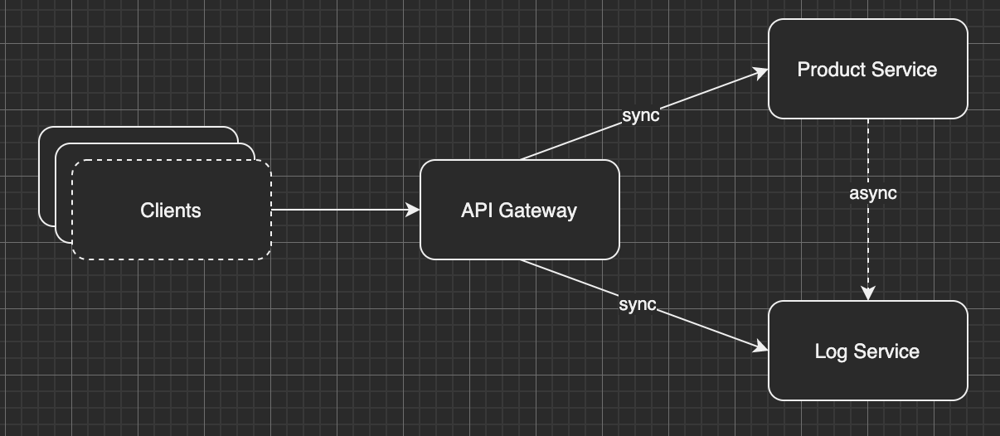
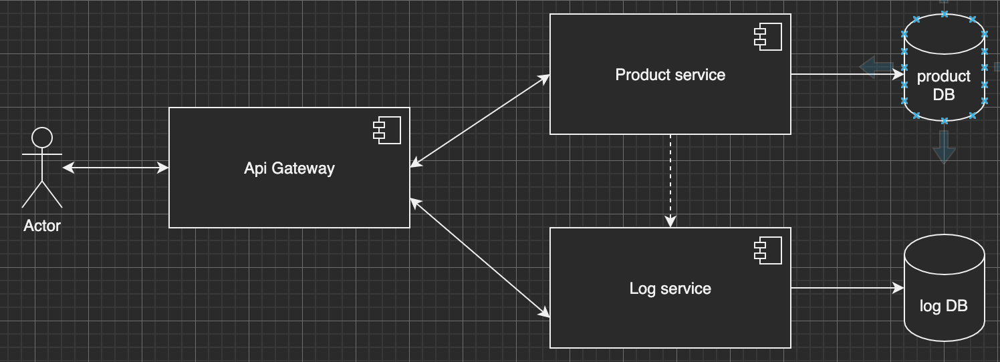

# This repository shows how you can build API with microservice architecture using nestjs
## Features of this example
This example is basically an API for ecommerce application. It provides a possibility to perform searching products based on color, name, brand ...
## Running the example with docker-compose

Execute command below from the root of the repository
```
docker network create infrastructure && cp .env.example .env && docker-compose up -d
``` 

**Notes**: The command below create a docker network `infrastructure` if the network has been exist, the error will be throw, in that case only execute
```
cp .env.example .env && docker-compose up -d
```

## Brief architecture overview
This API showcase consists of the following parts:
- Product service - responsible for search products
- Log service - responsible for tracking user's actions, and centralize log of microservices
- API Gateway - distribute requests to relevant services
- Inter-service communication support synchronous (request-response) and asynchornous (event-based)
- The service interact via **TCP sockets**
# Diagrams
### Archirecture


### Simple workflow


# Testing
Implemented a simple unit test to demonstrate testing controller class with mock mongo model (product-service)
```
npm run test
```

# API
## Create a product
```
curl --location --request POST 'http://localhost:8000/product/create_product' \
--header 'Content-Type: application/json' \
--data-raw '{
    "name": "Gucci Tshirt 2022",
    "description": "desc",
    "price": 434234,
    "brand": "Gucci",
    "variant": [
        {
            "color": "black",
            "image": "black.png",
            "size": "L"
        },
        {
            "color": "white",
            "image": "white.png",
            "size": "XS"
        }
    ]
}'
```

## Search product by name

```
curl --location --request POST 'http://localhost:8000/product/search_products' \
--header 'Content-Type: application/json' \
--data-raw '{
  "field": "name",
  "operator": "ilike",
  "value": "shirt"
}'

```

## Search products by color
```
curl --location --request POST 'http://localhost:8000/product/search_products' \
--header 'Content-Type: application/json' \
--data-raw '{
    "field": "variant.color",
    "operator": "=",
    "value": "pink"
}'
```
## Search products by price
```
curl --location --request POST 'http://localhost:8000/product/search_products' \
--header 'Content-Type: application/json' \
--data-raw '{
    "field": "price",
    "operator": "<=",
    "value": 434234
}'
```

## Points to extents: 
1. Only limited search criteria and operations has been supported
2. ...
